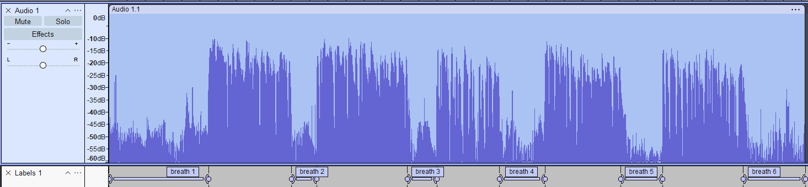
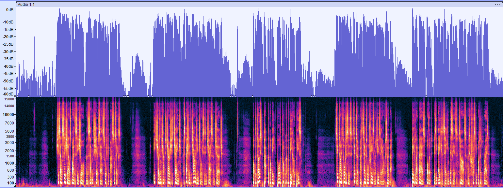
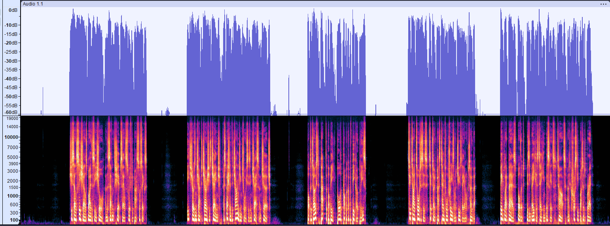
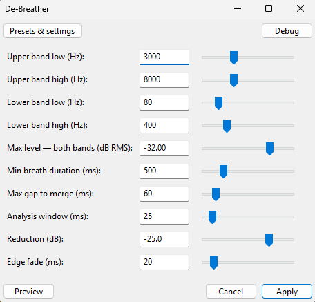

# De-Breather for Audacity

A free Nyquist plugin that detects breath sounds in spoken-word recordings and reduces their volume — without removing them entirely. Spend less time editing, keep the natural rhythm of speech.

## Where this fits in your post-production

De-Breather is **one tool in your chain, not a complete polish.** It handles breaths and pauses - the most tedious part of editing - but you'll still need:

- **EQ** to shape your voice tone
- **De-essing** to control sibilance
- **Compression** to even out dynamics
- **Limiting and loudness normalisation** for consistent delivery levels

The "Recommended workflow" section below shows where De-Breather sits in a typical chain (it goes early - before compression, so reduced breath levels don't confuse downstream LUFS measurements).

## The two plugins

The package ships as **two complementary plugins** sharing the same detection algorithm:

- **De-Breather Detect** - outputs labels marking each detected breath. Non-destructive. Use this to preview, tune your settings, and verify what the algorithm is finding before committing.
- **De-Breather Reduce** - applies gain reduction directly to detected breaths. Destructive (Undo to revert). Use this once Detect's labels look right.

Recommended workflow: run **Detect** first with default settings, look at the labels, adjust if needed, then run **Reduce** with the same settings to apply the reduction.

## Examples

**De-Breather Detect** in action - six breaths cleanly marked as labels on a real voiceover recording. Non-destructive: review and adjust before committing.

**Raw recording** (a different example) - five speech blocks separated by breaths and pauses. Note the energy in the gaps between phrases:

**After De-Breather Reduce** - same recording, breaths reduced. Speech blocks untouched. The gaps now sit cleanly at the noise floor:

A sample WAV file is included in the `examples/` folder so you can try the plugins on the same audio.

## What it does

Voiceover, podcast, and audiobook recordings often have audible breaths between phrases. Editing them out by hand takes hours. Most automated tools either:

- Use **amplitude gating** (which chops word edges or misses loud breaths), or
- Use **destructive silencing** (which makes the result sound robotic)

De-Breather does neither. It uses **spectral detection** - looking for the characteristic absence of mid/high-frequency speech energy - to find breaths reliably, then reduces their volume by a configurable amount. The default `-20 dB` reduction makes breaths nearly inaudible while preserving the natural rhythm of pauses.

It reduces breath **level**, not timing - pauses remain intact.

## How it works

A breath has a distinctive spectral fingerprint:

- **No upper-band energy** (3–8 kHz) - no consonants, sibilants, or fricatives
- **No lower-band energy** (80–400 Hz) - no voiced vowels or fundamentals
- **Sustained quietness** - at least 500 ms

Most speech has energy in *one or both* of these bands. Word decay tails still have low-band fundamentals. Quiet consonants still have upper-band hash. Only true breaths and pauses are quiet in *both* bands simultaneously for long enough to count.

Both spectral bands are configurable, so you can tune them for your voice. The defaults work well for typical adult voices on dynamic mics, but a higher voice might benefit from raising the lower band, and a deeper voice might benefit from lowering it. The upper band is also adjustable for mics that capture more or less air above 8 kHz.

The Reduce plugin scans the track, identifies regions matching this pattern, and applies a smooth gain reduction with linear fades to avoid clicks. The Detect plugin uses the same scan but outputs labels instead of modifying audio.

## Installation

1. Download both `DeBreather-Detect.ny` and `DeBreather-Reduce.ny` from the [latest release](https://github.com/MeanTemperature/DeBreather-for-Audacity/releases/latest)
2. Open Audacity → **Tools → Nyquist Plugin Installer**
3. Browse to each `.ny` file and click **Apply** (you can install both in one go by selecting both files)
4. Restart Audacity
5. Find them in **Effect → Noise Removal and Repair → De-Breather Detect...** and **De-Breather Reduce...**

Requires Audacity 3.2 or later.

## Usage

### Quick start

1. Open your recording
2. Select the whole track (Cmd/Ctrl+A)
3. **Effect → Noise Removal and Repair → De-Breather Detect...**
4. Use defaults, click **Apply**
5. Look at the labels in the new label track - each "breath N" marks a region the detector found
6. If the labels look right: re-select the track, run **De-Breather Reduce...** with the same settings, click **Apply**
7. If the labels look wrong: adjust settings (see Tuning guide), re-run Detect, repeat until happy

> 💡 **Tip:** When using Reduce, duplicate your track first or use Cmd/Ctrl+Z to undo if the result isn't what you want. Reduce has no preview - that's what Detect is for.

### Recommended workflow in a full chain

Run De-Breather *before* compression and loudness normalisation. Reducing breaths first stops the compressor and loudness stage from pulling them up or treating them as part of the programme level:

1. Record
2. **De-Breather Detect** (preview labels, tune settings)
3. **De-Breather Reduce** (apply the reduction)
4. EQ / De-essing / Compression
5. Limiter (peak control)
6. Loudness Normalization (e.g. -16 LUFS for podcasts/video)

## Settings

Both plugins share the same detection settings. Reduce adds two extra controls (Reduction and Edge fade) that don't apply to Detect.

| Setting                  | Default | What it does                                            |
| ------------------------ | ------- | ------------------------------------------------------- |
| Upper band low (Hz)      | 3000    | Lower edge of the "consonant absence" detection band    |
| Upper band high (Hz)     | 8000    | Upper edge - covers sibilance and fricatives            |
| Lower band low (Hz)      | 80      | Lower edge of the "vowel absence" detection band        |
| Lower band high (Hz)     | 400     | Upper edge - covers male/female fundamental ranges      |
| Max level (dB RMS)       | -45     | Both bands must be quieter than this to count as breath |
| Min breath duration (ms) | 500     | Shorter quiet regions are ignored                       |
| Max gap to merge (ms)    | 60      | Quiet regions closer than this are joined into one      |
| Analysis window (ms)     | 25      | Resolution of the scan                                  |
| Reduction (dB)           | -20     | (Reduce only) How much to attenuate detected breaths    |
| Edge fade (ms)           | 20      | (Reduce only) Smooth fade in/out at each region edge    |

### Tested settings (PodMic / dynamic mic at 5")

The before/after example was produced with these settings:

Notable differences from defaults:

- **Max level: -32 dB** (more permissive - catches breaths that aren't extremely quiet)
- **Reduction: -25 dB** (slightly stronger reduction)

These work well for close-mic'd dynamic recordings where breaths can be relatively loud. If your mic is further away or you're using a condenser, the defaults (-45 dB / -20 dB) will likely be a better starting point.

### Tuning guide

**Too aggressive** (real speech being reduced):

- Lower **Max level** (more negative - stricter)
- Raise **Min breath duration** to 700 ms

**Missing breaths** (real breaths not detected):

- Raise **Max level** (less negative - more permissive)
- Lower **Min breath duration** to 300 ms

**Want full silence instead of -20 dB**:

- Set **Reduction** to -100 dB

**Hearing clicks at boundaries**:

- Raise **Edge fade** to 50 ms

## What it doesn't do

- It's not a **noise gate** - it doesn't remove ambient room tone
- It's not a **denoiser** - for hum/hiss removal, use Audacity's built-in Noise Reduction
- It's not for **music** - designed specifically for spoken-word recordings
- It won't fix **bad mic technique** - heavy plosives, mouth clicks, and proximity-effect rumble need separate tools

## Limitations and known issues

- Best on **dynamic mics close to the speaker** (e.g. PodMic, SM7B, MV7) where breaths are well below speech level. Condenser mics at distance may need stricter `Max level` settings.
- May treat **deliberate dramatic pauses** as breaths and reduce them. If you want a pause kept at full volume, Undo and re-run with longer `Min breath duration`.
- Very quiet speech (whispered or distant) can be misclassified as breath if it lacks energy in both bands.
- **Word-final glottal stops** can be spectrally indistinguishable from short breaths. If a clean word ending gets reduced, manually re-amplify that region or run Reduce on a selection that excludes it.
- **Voice condition affects the spectral signature.** Colds, allergies, and tiredness change the spectral profile of breaths. Recordings made on different days may need different settings.

## Examples folder

In `examples/` you'll find:

- `sample-debreath-detect.png` - De-Breather Detect output: breaths marked as labels on a real recording
- `sample-raw.png` - spectrogram and waveform of a raw recording (different example)
- `sample-post-debreath.png` - same raw recording after De-Breather Reduce
- `sample-debreath-settings.png` - the settings used for the Reduce example
- `sample-raw.wav` - the original audio, so you can try the plugins on the same source
- `sample-post-debreath.wav` - the original audio with De-Breather Reduce applied

## Credits

Built collaboratively by [MeanTemperature](https://github.com/MeanTemperature) (a musician/voiceover maker) and Anthropic's Claude (an AI assistant), with a critical bug-spotting assist from Google's Gemini on the `pwlv-list` syntax.

The core spectral detection insight - *"anything with sustained absence of both upper-band detail and lower-band voicing is likely a breath or pause"* - came from staring at spectrograms while drinking tea.

## License

GPL v2 or later. Free to use, modify, and distribute.

## Feedback and contributions
This project is fully open-source, and contributions are welcome! 

Please read our [Contributing Guide](CONTRIBUTING.md) to see how you can help out—whether that's submitting bug reports, optimizing the code, or sharing the perfect settings for your specific microphone.

---

If you make videos or podcasts and this saves you time, that's the whole point. Tell a friend.
